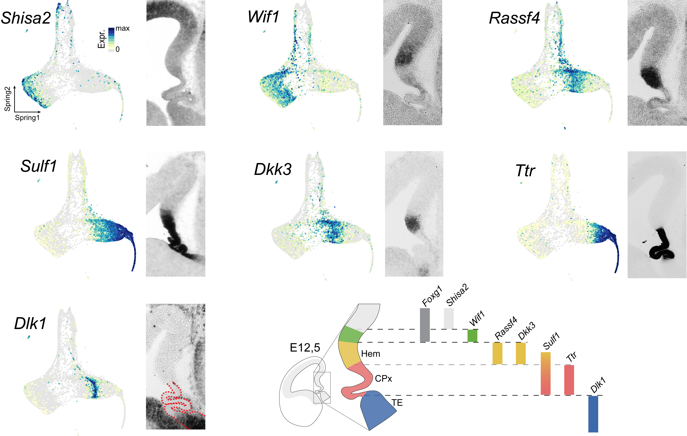

```{r setup, include=FALSE}
knitr::opts_chunk$set(echo = TRUE, fig.align = 'center', message=FALSE, warning=FALSE)
```

# Load libraries

```{r message=FALSE, warning=FALSE}
library(Seurat)
library(fastTopics)
library(RcppParallel)
library(Matrix)
library(dplyr)
library(RColorBrewer)
library(ggplot2)
library(ggExtra)
library(cowplot)
library(wesanderson)

#Set ggplot theme as classic
theme_set(theme_classic())
```

# load the dataset

```{r}
Hem.data <- readRDS("../QC.filtered.cells.RDS")
```

```{r}
DimPlot(Hem.data,
        reduction = "spring",
        cols = c(wes_palette("FantasticFox1"),"grey60"),
        pt.size = 0.5) & NoAxes()
```

# Extract the apical progenitors

```{r}
# Extract apical progenitors 
Progenitors.data <-  subset(Hem.data, idents = c(0,1,3))

DimPlot(Progenitors.data,
        reduction = "spring",
        pt.size = 0.5,
        cols = c(wes_palette("FantasticFox1")[c(1,2,4)]),
        split.by = 'ident') + NoLegend() & NoAxes()

rm(Hem.data) ; gc()
```

# Filter gene counts matrix

For this analysis we will keep only genes detected in at least 20 over 12325 cells

```{r}
progenitors.counts <- GetAssayData(object = Progenitors.data[["RNA"]], slot = "counts")
dim(progenitors.counts)

num.cells <- Matrix::rowSums(progenitors.counts > 0)
genes.use <- names(x = num.cells[which(x = num.cells >= 20)])
progenitors.counts <- progenitors.counts[genes.use, ]

dim(progenitors.counts)
```

```{r}
gc()
```

# Topic modeling

## Fit topic model

```{r fit_topic_model, cache=TRUE, class.output="scroll-100"}
set.seed(1)

fit <- fit_topic_model(t(progenitors.counts),
                       k = 15,
                       numiter.main = 200,
                       numiter.refine = 200,
                       method.main = "em",
                       method.refine = "scd",
                       control.main = list(numiter = 4, nc= 6),
                       control.refine = list(numiter = 4, nc= 6, extrapolate = TRUE),
                       verbose = "progressbar")
```

## Explore the different topics

```{r}
# Add cells' topics loading to the metadata
Progenitors.data@meta.data <- cbind(Progenitors.data@meta.data, fit$L)
```

```{r fig.dim=c(6, 9)}
FeaturePlot(object = Progenitors.data,
                    features = paste0("k", 1:15),
                    cols = rev(brewer.pal(10,"Spectral")),
                    reduction = "spring") & NoLegend() & NoAxes()

```

```{r fig.dim=c(6, 9)}
FeaturePlot(object = Progenitors.data,
                    features = paste0("k", c(15,12,9,8,14,6)),
                    cols = rev(brewer.pal(10,"Spectral")),
                    reduction = "spring",
                    order = T) & NoLegend() & NoAxes()

```

## Cluster Progenitors

```{r Kmeans clustering on topics PCs}
set.seed(1)
pca <- prcomp(fit$L[,c(15,12,9,8,14,6)])$x
clusters <- cluster::pam(pca, k = 6)$clustering
```

```{r}
Progenitors.data@meta.data$TopicsKmeans <- as.numeric(clusters)

FeaturePlot(object = Progenitors.data,
            features = "TopicsKmeans",
            cols = c(wes_palette("FantasticFox1"),"grey90", "grey40"),
            reduction = "spring") & NoLegend() & NoAxes()
```

```{r}
Idents(Progenitors.data) <- Progenitors.data$TopicsKmeans

DimPlot(Progenitors.data,
        reduction = "spring",
        pt.size = 0.5,
        cols =  c(wes_palette("FantasticFox1"),"grey90", "grey40"),
        split.by = 'ident') + NoLegend() & NoAxes()
```

# Progenitors domains specific gene expression

```{r Find markers}
domain.markers <- FindAllMarkers(Progenitors.data,
                                 only.pos = F,
                                 min.pct = 0.25,
                                 logfc.threshold = 0.3)

domain.markers.filtered <- domain.markers %>%
                            group_by(cluster) %>%
                            top_n(n = 4, wt = avg_log2FC) %>% 
                            unique()
```

```{r fig.dim=c(9,6)}
DotPlot(Progenitors.data,
        features = unique(domain.markers.filtered$gene)
        ) + RotatedAxis()
```

## Selected genes for tissue mapping

```{r fig.dim=c(9,6)}
DotPlot(Progenitors.data,
        features = c("Shisa2", "Wif1", "Rassf4", "Sulf1", "Dkk3", "Dlk1","Ttr")
        ) + RotatedAxis()
```



# Rename clusters

```{r}
ident = c("Dorso-Medial_pallium", "ChP", "Medial_pallium", "Hem", "ChP_progenitors", "Thalamic_eminence")

Progenitors.data$progenitor_type <- sapply(Progenitors.data$TopicsKmeans,
                                           FUN = function(x) {x= ident[x]})

Idents(Progenitors.data) <- Progenitors.data$progenitor_type
```

```{r}
DimPlot(Progenitors.data,
        reduction = "spring",
        pt.size = 0.5,
        cols =  c(wes_palette("FantasticFox1"),"grey90"),
        split.by = 'ident') + NoLegend() & NoAxes()
```

# Transfer identity to the full dataset

```{r Load full dataset}
Hem.data <- readRDS("../QC.filtered.cells.RDS")
```

```{r transfer identitis}
Hem.data$Cell_ident <- sapply(Hem.data$Barcodes,
                              FUN = function(x) {
                                if (x %in% Progenitors.data$Barcodes) {
                                  x = Progenitors.data@meta.data[x, "progenitor_type"]
                                } else {
                                  x = paste0("seurat_clusters_", Hem.data@meta.data[x, "seurat_clusters"])
                                  }
                              })
```

```{r}
DimPlot(object = Hem.data,
        group.by = "Cell_ident",
        reduction = "spring",
        cols = c("#83c3b8", #"ChP"
                 "#009fda", #"ChP_progenitors"
                 "#68b041", #"Dorso-Medial_pallium"
                 "#e46b6b", #"Hem"
                 "#e3c148", #"Medial_pallium"
                 "#b7d174", #2
                 "grey40", #4
                 "black", #5
                 "#3e69ac" #"Thalamic_eminence"
                 ))
```

# Save data

```{r}
saveRDS(Hem.data, "../QC.filtered.cells.RDS")
```

# Session Info

```{r}
#date
format(Sys.time(), "%d %B, %Y, %H,%M")

#Packages used
sessionInfo()
```
